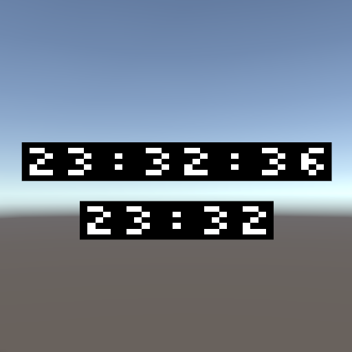

# Simple Clock

Simple Clock (by Shader)

## Install

### VRChat Creaters Companion (VCC)

1. Press "Add to VCC" on https://vpm.narazaka.net/ to add Narazaka's repository to VCC.
2. Make sure that "Narazaka VPM Listing" is enabled in VCC -> Settings -> Packages -> Installed Repositories.
3. Install "Simple Clock" from your project's "Manage Project".

## Usage

Simply place SimpleClockHM.prefab or SimpleClockHMS.prefab in your scene.

## License

[Zlib License](LICENSE.txt)
